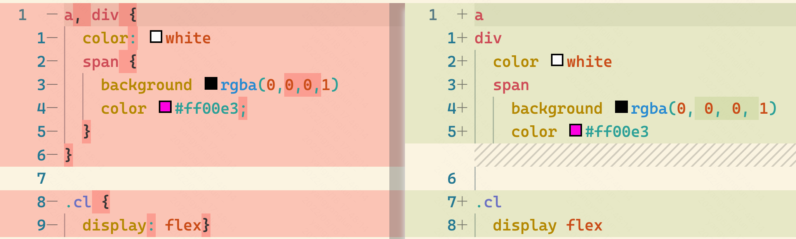

# prettier-plugin-stylus

[Prettier](https://prettier.io/) plugin for [Stylus](https://stylus-lang.com/).



## Features

- Pythonic style formatting
- [Compatible with Vue.js Single-File Components](https://prettier.io/blog/2022/06/14/2.7.0.html#infer-stylus-parser-for-vue-sfc-style-block-12707httpsgithubcomprettierprettierpull12707-by-lsdsjyhttpsgithubcomlsdsjy)

## Usage

```sh
npm i prettier-plugin-stylus
```

Then add it to your prettierrc file, e.g.:

```json
{
  "plugins": ["prettier-plugin-stylus"],
  "trailingComma": "all"
}
```

Or you can specify it in command line:

```sh
npx prettier --plugin=prettier-plugin-stylus some.styl
```

## TODO

- [ ] use vitest for tests
- [ ] @font-face
- [ ] object/hashes
- [ ] add plugin recommendation in prettier docs
- [ ] playground
